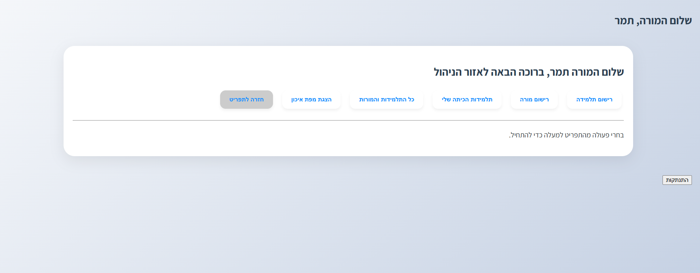
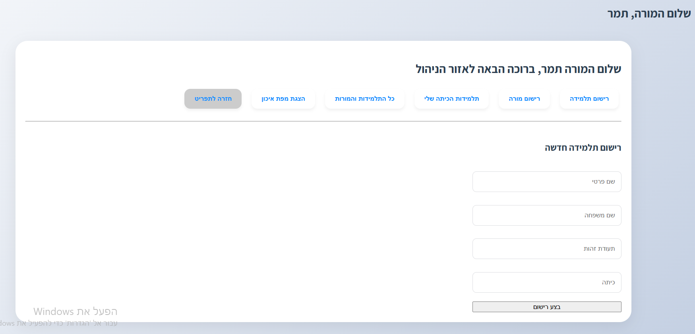
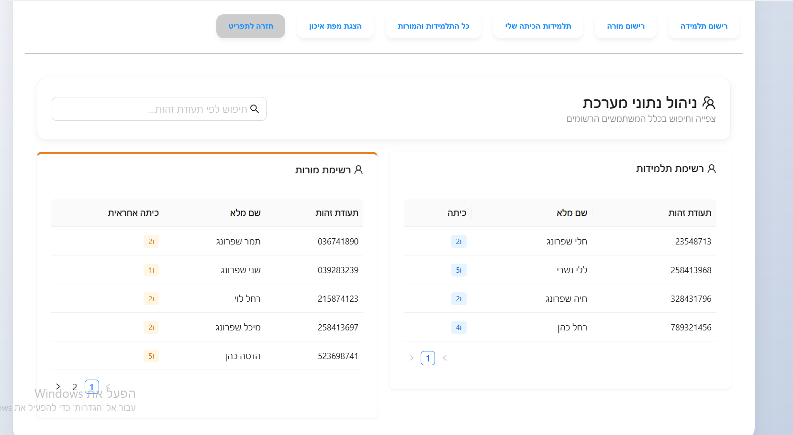
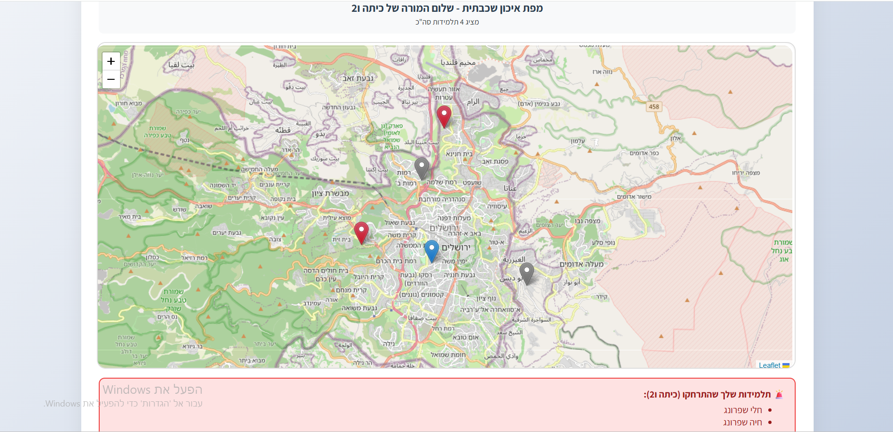

Annual Trip Management & Tracking System - "Bnot Moshe" 🌲🚶‍♀️
A full-stack real-time monitoring system for school trips. The system enables teachers to manage registration, track student locations on an interactive map, and receive automated alerts for students wandering out of range.  

screenShots

 Key Features
Teacher Login: Fast authentication using Identity Number (no password required).  

User Management: Register new students and teachers into the database.  

Data Management: View student and teacher lists with class-based filtering.  

Real-Time Tracking Map:

Visualizes locations of the teacher and all students on the map.  

Distance Alerts: Automatic identification of students more than 3 km away from the teacher (marked with red markers).  

Auto-Fit Zoom: The map automatically adjusts to keep all relevant participants in view.  

Movement Simulator: A backend mechanism that simulates student movement every minute for testing purposes.  

🛠 Tech Stack
Frontend: React (Vite), Ant Design (UI), Leaflet (Maps), Axios.  

Backend: Node.js & Express.  

Database: Microsoft SQL Server (MSSQL).  

Setup & Installation
Follow these steps to run the system locally:  

1. Database Configuration
Create a SQL Server database named HadasimTrip.  

Run the provided setup script to create the necessary tables.  

Update your connection credentials (User/Password) in server/db.js.  

2. Backend Setup
Bash
cd server
npm install
node index.js
The server will run at: http://localhost:5000

  

3. Frontend Setup
Bash
cd client
npm install
npm start
The application will be available at the address shown in your terminal (usually http://localhost:5173).  

 Technical Assumptions
Location Format: The system stores coordinates in Degrees, Minutes, and Seconds (DMS) format as required by the specification.  

Distance Calculation: Distance is calculated as a straight line (Euclidean distance) using a conversion factor of 111 km per geographic degree.  

Simulation Mode: To demonstrate the system without actual GPS hardware, the server randomly updates student locations every minute within a range of approximately one kilometer.  
 Submission Requirements
The project is managed as a Public repository on GitHub.  

The final submission version is tagged with the Git Tag: FINAL_VERSION.